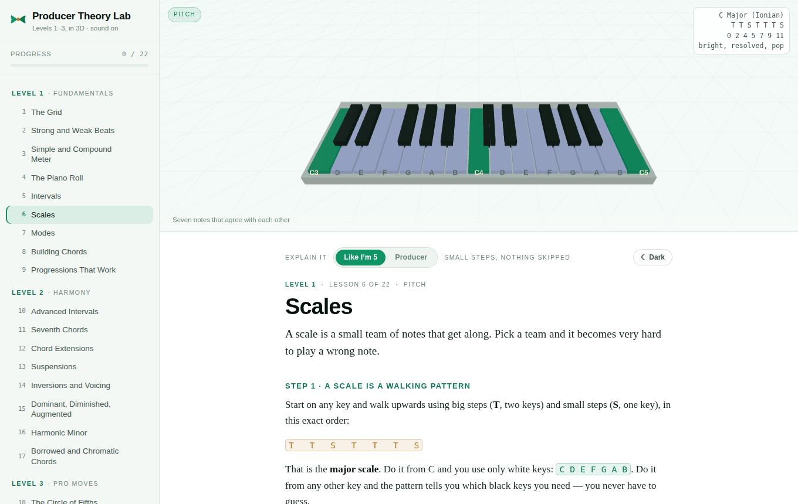
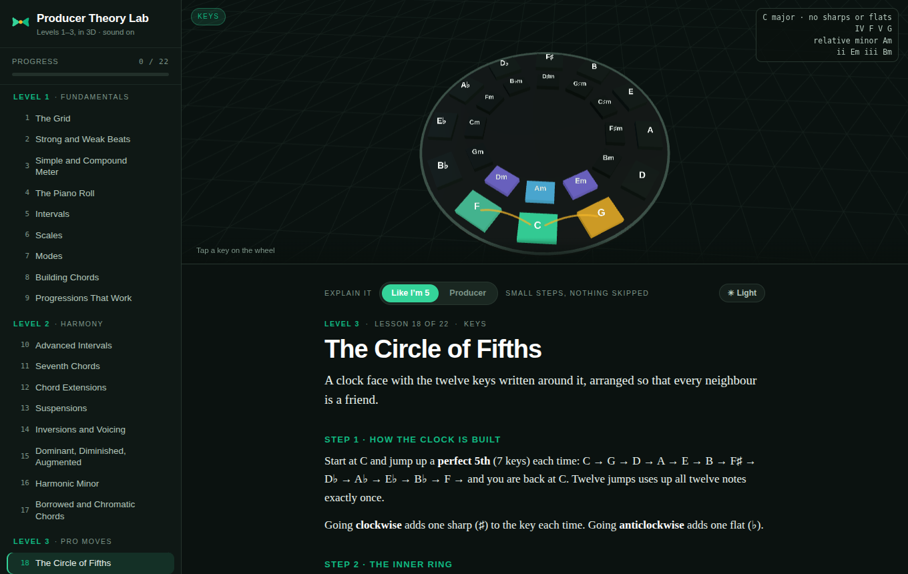

# MusicLearn — Producer Theory Lab

An interactive music theory course for producers. Twenty-two lessons, each attached to an
instrument you can play, with every sound generated live in the browser. No build step, no
framework, no dependencies to install — it is one HTML file, a stylesheet, and eleven scripts.



## What makes it different from reading a theory page

Every lesson drives a WebGL stage that changes instrument to match the topic:

| Stage | Used for | What you can do |
| --- | --- | --- |
| **Keyboard** | notes, intervals, scales, modes, chords, voicings | tap keys to hear them; chords appear as stacked, labelled tiles; intervals draw an arc with a dot per semitone |
| **Step grid** | the grid, strong/weak beats, meter | tap pads to build a beat; cell height shows how strongly a box lands |
| **Circle of fifths** | keys, modulation | tap a key to light its neighbours and hear its six-chord palette |
| **Piano roll** | melody writing, melody over chords, beat-block | draw notes on scale rows, see the contour ribbon, hear them over chord slabs |

Patterns, progressions and generated ideas survive a reading-level or theme switch, so changing
how a lesson is explained never throws away what you built in it — including edits you made to a
preset, which is what is kept rather than the preset's name.

Every instrument also has a **flat view**: the same keyboard, grid or roll drawn face-on, with a
name on every key and labelled lanes. Phones start there; on a desktop it is a toggle under the
stage. The circle of fifths has no face-on equivalent and keeps its 3D wheel.

Audio is a small Web Audio synth (triangle/saw voices, filter, envelope, convolution reverb)
plus a look-ahead step clock, so playback stays in time without blocking the UI.

## Two reading levels

A switch at the top of every lesson flips the text between:

- **Like I'm 5** — numbered steps and everyday analogies (apple vs strawberry for simple vs
  compound meter), written for someone who has never read a theory page. It is *longer* than the
  other level, not shorter: the same concepts, broken into smaller pieces.
- **Producer** — the dense version, in the vocabulary used in a studio.

The 3D stage, its controls and its audio are identical in both. Only the words change, so you can
switch mid-lesson without losing your place.

## Two themes

A light/dark toggle sits next to the reading-level switch. With no explicit choice the page
follows the device setting; once you pick one it is remembered. The 3D stage is repainted too —
each theme has its own palette, lighting rig and label ink, so text drawn on a key always
contrasts with that key.



## Curriculum

**Level 1 · Fundamentals** — The Grid · Strong and Weak Beats · Simple and Compound Meter ·
The Piano Roll · Intervals · Scales · Modes · Building Chords · Progressions That Work

**Level 2 · Harmony** — Advanced Intervals · Seventh Chords · Chord Extensions · Suspensions ·
Inversions and Voicing · Dominant, Diminished, Augmented · Harmonic Minor · Borrowed and
Chromatic Chords

**Level 3 · Pro moves** — The Circle of Fifths · Melody Craft · Melody Over Chords ·
A Cure for Beat-Block · Challenges (ear-training drills)

Progress is remembered per browser, and each lesson ends with self-check questions that explain
the answer either way.

**Completion and understanding are tracked separately.** "Mark this lesson done" records that you
worked through it; alongside it the sidebar keeps a **drill score** from the first answer you give
each question and from the ear-training drills, and flags any lesson you got something wrong in
with an amber `!` so you know what to revisit. You can reset a lesson's questions at any time.

## Practise it, then review what you missed

Fourteen lessons carry a short round under the text: **hear an example, name it, then build the
same thing on the instrument** — play that interval back from a given root, stack that chord, put
that pattern on the kick lane. Both halves are marked, and what you get wrong is recorded against
the *concept*, not the lesson.

Those misses collect into a **Review** page reachable from the sidebar. It asks the same idea
again with different notes, in a different key, on whichever instrument that concept belongs to —
switching the stage between a keyboard question and a drum-grid one as it goes. A concept leaves
the list after three right answers in a row, so the page empties as the gaps close. Alongside it
a table shows each concept's record, its last six attempts and its trend, so improvement is
visible rather than asserted.

## Keeping what you make

The six lessons with something worth keeping — the two drum-grid lessons, the three piano-roll
ones and the progression builder — carry a **Keep this** panel:

- **Undo and redo**, on the buttons or `Ctrl+Z` / `Shift+Ctrl+Z`.
- **Save** named ideas, which stay in this browser and can be reloaded later.
- **Export MIDI** — a standard MIDI file at the tempo shown, drums on the General MIDI drum
  channel with the right kick, snare and hat notes, so it drops straight into a DAW.

## Running it

Open `index.html` in a browser. That is the whole setup.

Three.js loads from a CDN, so the 3D stage needs a network connection the first time; if it
cannot be reached the lessons still read as text. To serve it locally:

```bash
python3 -m http.server 8000     # then open http://localhost:8000
```

To publish it, any static host works — including GitHub Pages (Settings → Pages → deploy from
the default branch, root folder).

## Single-file build

`build.js` inlines the stylesheet and all eleven scripts into one file:

```bash
node build.js              # → dist/musiclearn.html   standalone, open it anywhere
node build.js --artifact   # → dist/artifact.html     body-only, for claude.ai Artifacts
```

`index.html` stays the source of truth; the build only rewrites how it is packaged.
`dist/musiclearn.html` is committed so you can grab the whole app as one file; the artifact
variant is generated on demand and not tracked.

## Layout

```
index.html              the app shell — markup, fonts, script order
build.js                single-file bundler
test/check-theory.js    theory and lesson-data assertions across all twelve keys
test/check-behaviour.js what the lessons DO — mode switches, presets, controls, MIDI, practice
src/styles.css          design tokens; light palette on :root, dark under the toggle + media query
src/theory.js           T = pitch/scale/chord maths · A = synth, drum voices, look-ahead clock
src/scenes.js           V = one WebGL canvas with four swappable instruments + both palettes
src/ui.js               UI = control builders · APP = nav, rendering, progress, mode, theme
src/practice.js         PRACTICE = hear it / name it / build it, and the record of what you missed
src/studio.js           STUDIO = undo, saved ideas, and the MIDI file writer
src/flat.js             FLAT = the same instruments drawn face-on, from the a11y descriptor
src/lessons-level1.js   LESSONS 1–9    (producer text, 3D wiring, quizzes)
src/lessons-level2.js   LESSONS 10–17
src/lessons-level3.js   LESSONS 18–22
src/simple-level1.js    SIMPLE text for lessons 1–11
src/simple-level2.js    SIMPLE text for lessons 12–22
docs/SOURCES.md         conventions, references, corrections log
docs/                   README screenshots
```

### Adding or editing a lesson

A lesson is plain data plus one setup function:

```js
LESSONS.push({
  id:'intervals', level:1, tag:'Pitch', title:'Intervals',
  lede:'One sentence that frames the lesson.',
  stage:{ view:'keys', cfg:{ lo:48, hi:72, labels:'names' } },
  blocks:[
    { h:'A heading' },
    { p:'A paragraph, with <b>markup</b> allowed.' },
    { keys:['a bullet', 'another'] },
    { note:{ h:'Aside', p:'A boxed remark.' } },
    { table:{ head:['A','B'], rows:[['1','2']] } },
    { try:{ h:'Try it', p:'What to do.', build:ctx => [ UI.btn('Play', () => ctx.demo()) ] } }
  ],
  quiz:[ { q:'Question?', a:['wrong','right'], c:1, why:'Why that is the answer.' } ],
  init:ctx => { /* wire the 3D view: ctx.v, ctx.read(), ctx.seq(), ctx.stage() */ }
});
```

`views` are `keys`, `grid`, `wheel` and `roll`. Inside `init`, `ctx.v` is the live view,
`ctx.read()` writes the HUD readout, `ctx.stage(...)` adds controls under the stage, and
`ctx.seq({bpm, div, steps, cb})` runs the transport.

The simple-mode text for a lesson lives in `SIMPLE[<lesson id>]` with the same `blocks` shape. A
simple-mode `try` block carries `{ use:true }` instead of a `build`, and the renderer reuses that
lesson's own controls, so an interaction is only ever written once.

## Accessibility

The 3D stage is marked decorative, and every instrument it draws is mirrored as real HTML
buttons under it — *Instrument controls*, open on demand and always present in the accessibility
tree. Each key, pad and tile is a focusable `<button>` with a spoken label ("C4, white key";
"Kick, step 3 of 16, beat 1, on"), the piano roll gets a compact add/remove form instead of 240
buttons, and the readout above the lesson is a polite live region, so what the instrument just
did is announced as text.

Those buttons are built *after* the lesson has loaded and re-read from the instrument after every
change, so what a screen reader announces is the instrument's real state rather than a guess about
what the last tap did. Only attributes that actually changed are rewritten, so a running playhead
repainting many times a second does not make a screen reader chatter through the loop. The flat
view is drawn from the same descriptor, which is why it follows every lesson without any lesson
knowing it exists.

## Accuracy

Theory here is **generated, not typed**: scales, chords, intervals, diatonic sets, roman numerals
and note spellings all come from `src/theory.js`, so a lesson cannot display a chord name that
contradicts the notes it plays. Note names are spelled by letter degree, which is why C minor
reads C–E♭–G rather than C–D♯–G.

```bash
node test/check-theory.js      # 581 assertions, all twelve keys
node test/check-behaviour.js   # 646 assertions, what the lessons do
```

The first covers the engine in every key plus the lesson data (answer indices in range, distinct
options, no note-set answers that are merely reorderings of each other, both reading levels
present).

The second runs the real lesson code against a recording stand-in for the stage, and covers the
things that break when two parts of the app describe the same thing differently:

- a chord's name, its written notes and the notes it plays agree, in every scale and on every degree;
- switching reading level keeps an edited progression, and every control comes back showing what
  is actually loaded;
- a preset change is saved and announced to the accessible panel, which exposes the same number of
  steps the lesson is really using;
- the two reading levels' questions score separately;
- ear training never lights a key it did not play, in any drill, at any register;
- a practice round's notes always fit the keyboard that lesson puts on stage;
- the review asks the concept you missed, with different notes, still among several options;
- the MIDI it writes decodes back to the notes, channels and tempo it claims.

All 22 lessons are also walked in a headless browser in both reading levels, both themes and both
instrument views, clicking every control and every quiz option.

What it does not cover: pedagogy, lesson ordering and the wording of explanations — this has not
had a music-educator review. Conventions used, references, and the list of corrections already
applied are in [docs/SOURCES.md](docs/SOURCES.md). Corrections are welcome via
[an issue](https://github.com/virtuosolefty/MusicLearn/issues/new).

## Known gaps

Honest list of what this is not, so nobody is misled:

- **Not reviewed by a music educator.** The maths is verified; the teaching is not peer-reviewed.
- **Eight lessons have no practice round.** The fourteen whose own instrument can express what
  they teach have one. Meter, inversions, borrowed chords, the circle and the three melody
  lessons do not — their ideas need a build step that has not been designed yet.
- **The beginner path is harmony-heavy.** Pulse, subdivision, note length and rests come first,
  but melody and bass writing arrive late — after modes and extensions rather than before them.
- **Saved work is per browser.** Ideas and progress live in `localStorage`: no account, no sync,
  and clearing site data clears them. MIDI export is the way to take work with you.
- **Nothing is scheduled.** The review shows what you have missed, but there is no spacing
  algorithm deciding when to ask again — you choose when to open it.
- **Genre references are broad.** Where a lesson says a style "uses" something, it is pointing at
  a tendency, not citing a specific record.

## Credits

Built as a companion to the concepts in the Red Bow Music *"All The Music Theory A Producer
Needs"* curriculum (Levels 1–3). The explanations, exercises and code here are original work
written against that syllabus — none of the course's own material is reproduced. If you want the
course itself, it is at [redbowmusic.com](https://redbowmusic.com/).

Type: Bricolage Grotesque, Newsreader and IBM Plex Mono via Google Fonts. 3D: Three.js.
