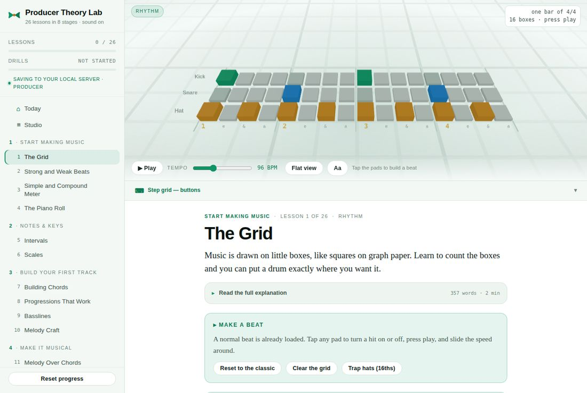
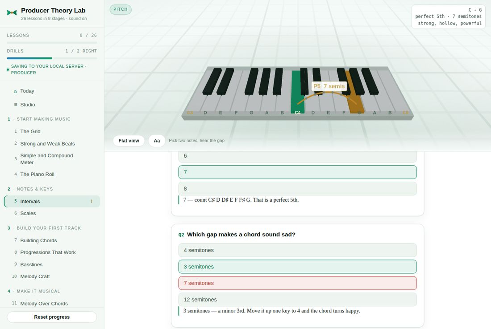
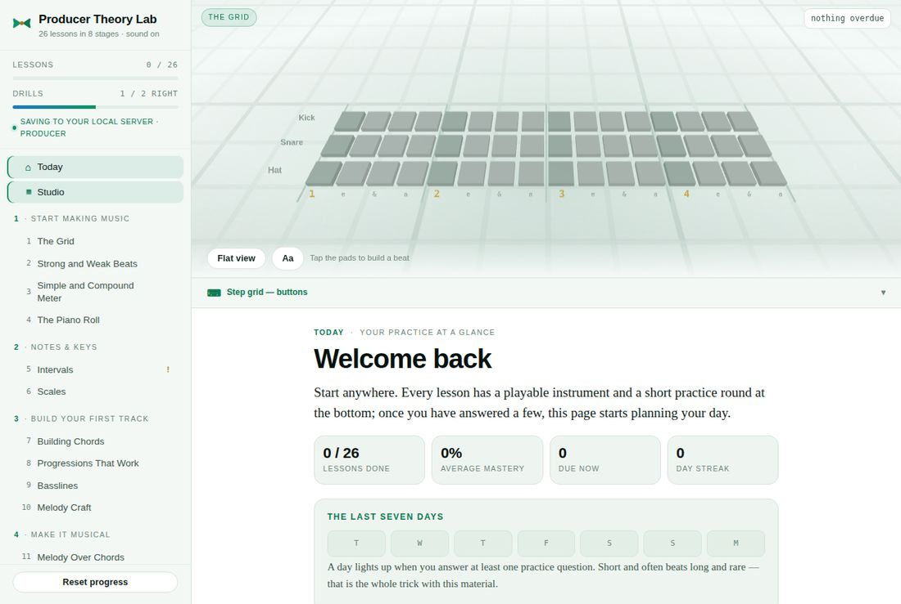
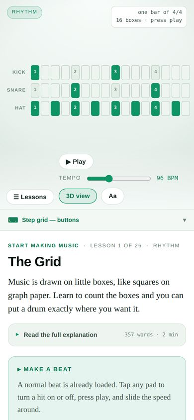

# UI/UX audit — what stands between Producer Theory Lab and production-ready

Scope: **visual and interaction design only** — how the app looks, moves, responds and guides.
No content, backend or feature changes. Audited 2026-09-21 against the current build, with every
claim about this app measured in a browser at 1280px and 390px, in both themes, with a real WebGL
stage. Competitor claims are sourced at the bottom.

The short version: the structure is sound and the 3D stage is genuinely distinctive — none of the
apps reviewed here teaches theory on a playable 3D instrument. What makes it read as a prototype rather
than a product is **the absence of moments**. There is not one CSS animation in the codebase. A
right answer, a finished lesson and a seven-day streak all look the same as a page that has not
loaded yet. The competitors below spend most of their visual budget exactly there.

> **Status (2026-09-21): implemented.** Every change in section 3 — P0.1–P0.7, P1.1–P1.6 and
> P2.1–P2.5 — is in the build. Re-measured afterwards: no rendered text below 12px, 9 keyframe
> animations (was 0), every Unicode icon replaced by the SVG sprite in `src/icons.js`, 44px touch
> targets on coarse pointers, the Today nav bug fixed, and `prefers-reduced-motion` honoured by
> every animation and by the stage (no dip, no drift, no confetti motion). Deviations from the
> plan: confetti and the falling note bars use their own instanced meshes rather than sharing the
> spark pool, which adds two draw calls while they are on screen; the Today path is also drawn
> face-on by the flat view, so Today works without WebGL; a failed WebGL context offers the flat
> view instead of a blank stage.

---

## 1. Competitor patterns worth adopting

### Feedback that you can feel, not just read

**Duolingo** is the reference everyone copies, and the specifics matter. A right answer raises a
green banner with a check and a chirp; a wrong one raises a red banner showing the correct answer,
a softer "boing", and a **"Got it"** button rather than punitive language. Crucially, *the progress
bar still advances after a wrong answer*, so nobody feels stuck. Lesson completion fires confetti,
and bigger milestones get a bigger burst. Buttons have a thick bottom border that collapses when
pressed, so every tap feels physical.

**Melodics** makes its animations respond to the instrument itself: "when learners hit the right
notes, the animations respond instantly" — a direct loop from MIDI input to the animation state
machine. Streaks, stars and levels are all animated rewards. They teach technique the same way: short animations show how to hold drumsticks, adjust a seat or
place hands, because those were "much easier to update than video tutorials".

**Takeaway for this app:** every interaction that can be right or wrong needs a visual state, a
motion and a sound — all three, not colour alone.

### One screen, one job, and the instrument is the hero

**Simply Piano** renders its lesson screen with a 2D game engine rather than UI components, so that
notation, animation and audio run together at 60fps — the on-screen piano is batched into a texture
atlas so it draws in a single call.
The lesson screen is the product — everything else is navigation to get there.

**Yousician's** play screen is a moving fretboard with one timing cue — a white ball that bounces
from note to note; "as it strikes, that's your cue to play." One element carries the whole
instruction. The same reviewer notes the bright, toy-like look gets "irritating after a while" —
a warning against over-gamifying.

**flowkey** splits the screen into a video of real hands above and one line of notation below, with
a playhead moving through it. The reviewer calls the look "simple, clean, and not overcomplicated",
and finds desktop and mobile "virtually identical".

**Synthesia-style falling notes** — bars descending onto the keys — are the most instantly readable
piano visualisation there is. The honest criticism is that it "trains you to follow, not to play".
Useful as a *preview* of what is coming; harmful as the only way the learner ever sees music.

**Takeaway:** when there is an instrument on screen, the instrument should carry the instruction,
fill the frame, and animate in time with the music.

### Progress you can see from across the room

Yousician gates harder content on **stars** you can count at a glance. Playground Sessions is
praised for "clear progress tracking with visible milestones". Duolingo's skill tree used crowns and
gold stars as visible state on every node.

**Takeaway:** progress is a *shape*, not a number. Four stat cards reading "0 / 26, 0%, 0, 0" is a
number.

### Restraint

The best-reviewed interfaces here are the plainest: flowkey's "clean", Simply Piano's "extremely
intuitive" (Skoove's own blog makes the same pitch for itself, "thoughtfully designed"). The loud ones (Yousician) are praised for fun and
criticised for fatigue. The pattern to steal is **calm surfaces, expressive moments** — a quiet UI
that erupts briefly when you do something right.

---

## 2. Gaps in the current app

Measured, not estimated. Screenshots are in `docs/audit/`.



### G1 · No motion anywhere
**0** `@keyframes` rules in `styles.css`; 10 transitions total — hover colours, one progress-bar
width and one chevron. Nothing
animates on a right answer, a wrong answer, a finished practice round, a ticked lesson, a streak
day or a first visit. The app has a `prefers-reduced-motion` rule — but no motion for it to reduce.

### G2 · The core interaction is a two-frame snap
Pressing a key on the 3D keyboard (`scenes.js`, `press()`) moves it down 0.11 units and sets a
white emissive of 0.6 **instantly**, then repaints it back **instantly** 260ms later. No easing, no
glow decay, no velocity, and no difference between a right note and a wrong one. This is the most
repeated gesture in the app and it has the least polish.

### G3 · Right and wrong are colour only


A right option turns pale green, a wrong one pale red. No icon, no word, no motion, no sound (unless
that question happens to play one). That fails WCAG 1.4.1 (*use of colour*) for anyone with
red–green colour blindness — which is the one pair of colours the app uses.

### G4 · Small, low-contrast type
- **15 distinct font sizes** render on a single lesson page, in 0.5px steps from 10px to 15.5px —
  there is no type scale, just a lot of nearby numbers. The CSS declares 19.
- **89 of 263** visible text nodes (34%) on a lesson page are **under 12px** — mostly the uppercase
  labels (`LESSONS`, `START MAKING MUSIC`, `TEMPO`, `LESSON 1 OF 26`).
- Those labels use `--muted`, which in the light theme is **3.97:1** on white and **3.58:1** on
  the panel background. WCAG AA needs 4.5:1 for text this size. (Dark theme passes: 5.82:1.)

### G5 · Icons are Unicode characters
About 35 glyphs stand in for icons — ⌂ ▦ ☰ ↻ ↓ ▶ ■ ✓ ✗ ☀ ☾ ♪ — and there is exactly one SVG in the
UI (the logo). Glyphs render in whatever font the OS falls back to: on some platforms ☀ and ☾
become colour emoji, ▦ and ⌂ change weight, and none of them align to the text baseline the same
way. This is the single biggest "prototype" tell at a glance.

### G6 · Touch targets
At 390px, **149 of 152** rendered controls (counting the off-screen lesson drawer) are under the
44pt Apple's Human Interface Guidelines recommend for touch — most sit at 28–32px: chips, nav rows,
bar buttons, the settings button. All but one clear WCAG 2.2's AA floor of 24px (2.5.8) — the
exception is the tempo slider, whose track is 16px tall — so this is mainly a comfort and polish
gap on phones rather than a compliance failure; the 44px target is WCAG's AAA level (2.5.5).

### G7 · The stage has no role on non-lesson pages


On **Today**, the stage shows whatever instrument the practice queue last used — in the screenshot,
an empty drum grid captioned "Tap the pads to build a beat" — above a dashboard. It says nothing
about today. The same happens on Review. The most striking part of the app is spent on noise.

### G8 · Empty states read as failure
A new learner's Today opens on four cards reading **0 / 26 · 0% · 0 · 0** and seven identical grey
day boxes. Nothing is broken, but it looks like a report card from a course you have already failed.

### G9 · Navigation state bug
On Today, **both** Today and Studio render as the current page — `renderHome()` marks every nav
button without a lesson id as current, and Studio has none (`ui.js`, the `aria-current` line in
`renderHome`). Two highlighted items is the kind of detail that makes an app feel unfinished.

### G10 · Small things that add up
- The review flag in the sidebar is a bare amber **"!"** with no label.
- The readout box over the stage is three lines of mono text, right-aligned — dense to scan while
  playing.
- The **Aa** button does not say what it opens.
- While WebGL boots, the readout says `loading…`; when it fails, the stage shows a paragraph of
  grey text in an empty room. Neither is designed.
- On desktop the instrument spans about **60–70% of the stage width** (keyboard ~60%, step grid
  ~70%) and sits in a middle band, with empty floor above and below.



---

## 3. Prioritised changes

Every item below changes how something looks, moves or responds. Where one needs a little code
— the navigation fix, the particle pool, the constellation — it reads state the app already has;
none adds content, stores anything new, or changes what a lesson teaches.

Ordered by visible impact per hour. **P0** is an afternoon each and removes the prototype tells.
**P1** is the feel. **P2** is the showcase.

### P0 — remove the tells

**P0.1 · Contrast.** Change light-theme `--muted` from `#6E8579` to **`#586F63`**: 5.43:1 on white,
4.90:1 on `--panel-2`, 4.56:1 on `--panel-3` — AA everywhere it is used, and visually almost the same
green-grey.

**P0.2 · A type scale with a floor.** Replace the 15 sizes with six tokens and nothing under 12px:

```css
:root{ --t-xs:12px; --t-sm:13px; --t-base:15px; --t-md:17px; --t-lg:21px; --t-xl:34px; }
```

Uppercase micro-labels move from 10–10.5px to `--t-xs` with `letter-spacing:.08em` (down from
.14em — wide tracking at small sizes is what makes them hard to read).

**P0.3 · An icon set.** One inline SVG sprite (`<svg><symbol id="i-play">…`), 20px, 1.75px stroke,
`currentColor`, referenced as `<svg class="i"><use href="#i-play"/></svg>`. About 16 icons cover
everything: home, studio, menu, play, stop, retry, download, check, cross, sun, moon, settings,
chevron, music-note, keyboard, flag. Lucide (ISC) and Phosphor (MIT) are both permissively
licensed and match the Bricolage geometry. This alone changes how finished the app looks.

**P0.4 · Right and wrong in three channels.** A quiz option that is right gets a check icon and
the word **Correct**; wrong gets a cross and **Not quite — the answer is highlighted**. Colour stays
as a third signal. The explanation line gets a coloured left rule matching the verdict.

**P0.5 · 44px on touch.** Under `(pointer: coarse)`, chips, nav rows, bar buttons, the settings
button and step cells get `min-height:44px` — without changing the desktop layout. Range inputs
get a 44px-tall hit area with the visible track still thin (`height:44px` on the input, styling on
`::-webkit-slider-runnable-track` / `::-moz-range-track`), which also fixes the one control under
WCAG's 24px floor.

**P0.6 · Fix the double highlight.** In `renderHome()`, mark only `.home-item` as current rather
than every button without a lesson id.

**P0.7 · Label the cryptic bits.** The "!" becomes a small amber dot with `aria-label` and a
tooltip *"You missed a question here — worth revisiting"*. **Aa** becomes a settings icon with the
visible label **Display**.

### P1 — make it feel good

**P1.1 · A motion system.** Four tokens, used everywhere, and the existing reduced-motion rule
finally has something to do:

```css
:root{
  --ease-out: cubic-bezier(.2,.8,.2,1);   /* entering, confirming */
  --ease-spring: cubic-bezier(.34,1.56,.64,1); /* rewards, pops */
  --d-fast:120ms; --d:200ms; --d-slow:360ms;
}
```

Buttons press down 1px on `:active` with a 2px bottom border that collapses (Duolingo's tactile
press); panels fade-and-rise 8px on entry; the page-to-page swap cross-fades over `--d`.

**P1.2 · Answer micro-interactions.**
- *Right:* option scales `1 → 1.03 → 1` over 180ms with `--ease-spring`; the check icon draws in
  (stroke-dashoffset, 240ms); a short bell plays through the existing `INSTRUMENTS.play('bell')`.
- *Wrong:* option shakes ±4px three times over 280ms; the correct option pulses once; a low, soft
  pluck plays. Never a buzzer.
- The drills bar in the sidebar animates its width change (it already has a transition — it just
  needs to be visible when it moves).

**P1.3 · 3D — key press with weight and a burst.** *Where:* every 3D instrument (keys, grid pads,
wheel tiles, roll cells). *What:* replace the snap in `press()` with a spring and a particle burst.

- **Press:** the key's `position.y` becomes a spring target, stepped in the existing render loop
  with a critically-damped spring (stiffness ~420, damping ~2√k) so it dips fast and settles
  without wobble. Depth scales with velocity where the lesson has one (0.06 soft → 0.12 accent).
- **Glow:** emissive intensity jumps to 0.9 and decays exponentially (`k.glow *= Math.pow(0.001,
  dt/0.35)`) — a 350ms fade, not a 260ms switch-off.
- **Burst:** one shared `InstancedMesh` (a 1×1 plane with a soft radial texture, `AdditiveBlending`,
  `depthWrite:false`) of **192** instances in a pool. A press claims 12–16, spawns them at the key
  top with an upward cone of velocities, and fades them over 420ms with slight gravity. Per-instance
  life and velocity live in two `Float32Array`s updated in the loop; dead instances scale to zero.
  **Colour carries meaning where the page already knows the answer:** during a practice round's
  build step, which already judges each press, green for a wanted note and amber for one that is
  not; everywhere else — free play, demos — a neutral white.
- **Cost:** +1 draw call, no allocation after start-up. Well inside the ~100 draw calls a mobile
  frame can afford.
- **Reduced motion:** glow only — no dip, no particles.

**P1.4 · 3D — a ring wave under a right answer.** When a quiz or practice answer is right and the
lesson has an instrument, a flat `RingGeometry` under the relevant keys expands from radius 0.2 to
2.4 and fades to zero over 520ms. It ties the verdict below to the instrument above — the
equivalent of Melodics' "the animations respond instantly".

**P1.5 · The moment a lesson or session ends.** A centred card rises over the console (`--d-slow`,
`--ease-spring`) with the lesson's title and its existing lede, the streak, and one button — no new
writing needed.
Behind it, the stage fires a **confetti burst** from the same particle pool, switched to small
spinning quads (random `rotation` per instance, 3 palette colours), 120 instances, gravity, 1.6s.
Scale it to the milestone as Duolingo does, reading state the app already keeps: a ticked lesson
gets a small burst, the last lesson of a stage a larger one, a streak reaching seven days the
largest. Reduced motion: the card, no confetti.

**P1.6 · The readout as a chip, not a paragraph.** One large value (`C → G`), one small line
(`perfect 5th · 7 semitones`), left-aligned under the stage tag instead of a right-aligned mono
block. It becomes readable at a glance while playing.

### P2 — the showcase

**P2.1 · 3D — a progress constellation on Today.** *This replaces G7 and G8 at once.*

*Where:* the stage on **Today**, instead of the stray instrument.

*What:* the 26 lessons as glowing nodes along a gentle rising spiral, grouped into the 8 stages,
seen from slightly above.

- **Build:** a `CatmullRomCurve3` through 26 points on a rising spiral; a thin `TubeGeometry`
  along it as the path; one `InstancedMesh` of 26 low-poly spheres (`SphereGeometry(0.18, 16, 12)`)
  placed on the curve; 8 `Sprite` labels for stage names only.
- **State as shape:** not started — dim, small; done — lit accent green, full size; mastery raises
  brightness and scale continuously (0.8 → 1.2); due for review — an amber ring; **next up** —
  pulses gently (scale 1 ± 0.06, 1.8s cycle) with a soft point light.
- **Behaviour:** idle camera drifts slowly around the spiral (one revolution per ~90s); drag to
  orbit; tap a node → raycast the `InstancedMesh` (`intersects[0].instanceId`) → open that lesson,
  the same destination as its row in the sidebar. Every state it shows is read from progress the app
  already stores; nothing new is recorded.
- **Empty state:** a new learner sees a dim spiral with the first node pulsing — an invitation,
  not a column of zeros. The four stat cards move below and hide while they would read zero.
- **Cost:** 3 draw calls plus labels; render on demand, and pause the idle drift when the tab is
  hidden.

**P2.2 · Frame the instrument.** The camera fit should put the instrument across ~80% of the stage
width rather than 60–70%, and lower the camera slightly so less of the frame is floor. On Review, Studio and Today, the stage either shows something about that page
(P2.1) or is hidden, as Studio already does.

**P2.3 · 3D — falling-note preview during demos.** *Where:* keys and roll views, **only while a
lesson is demonstrating** — never during a practice round, per the Synthesia criticism.
*What:* one `InstancedMesh` of rounded boxes, one per note the demo **already schedules** through
the transport, descending toward its key at a constant speed so each lands on its audio time; on landing it triggers the P1.3 press and
burst. Colour by role (root, chord tone, melody) using the stage's existing mark palette. The
learner sees what is coming, and when.

**P2.4 · Designed loading and failure.** While WebGL boots: a skeleton of the instrument's outline
with a slow shimmer. If it fails: a designed card with one line and a **Use the flat view** button,
instead of a paragraph over an empty room — the flat instrument already exists and works.

**P2.5 · Rewarding the week strip.** Today's box gets an outline marker; a day filling in animates
(scale from 0.6 with `--ease-spring`). At seven filled days the strip plays a single left-to-right
shimmer.

---

## 4. Rules for every 3D addition

- **One particle pool, shared.** Bursts, confetti and glows reuse the same `InstancedMesh`. No
  per-effect geometry, nothing allocated after start-up.
- **Pixel ratio capped at 2**; target **≤100 draw calls** per frame on mobile; watch
  `renderer.info` stays flat over a session — climbing numbers mean a leak.
- **Delta-timed animation**, so a 120Hz phone and a 60Hz laptop move at the same speed.
- **Render on demand** when nothing is moving; stop the loop when the tab is hidden.
- **Everything respects `prefers-reduced-motion`**: glows yes, particles and camera drift no.
- **Every 3D state has a 2D twin** in the accessible instrument panel — a burst is never the only
  way to learn an answer was right.

---

## 5. Suggested order

1. **P0.1–P0.7 together** — one pass, one afternoon to a day. After this the app stops looking like
   a prototype in screenshots.
2. **P1.1 → P1.2 → P1.3** — the motion tokens, then answers, then the key press. This is where it
   starts to *feel* like a product.
3. **P1.5** — the end-of-lesson moment, reusing P1.3's particle pool.
4. **P2.1** — the constellation. The most visible single change, and it fixes Today's two biggest
   problems.
5. **P2.2–P2.5** as polish.

---

## Sources

- [Duolingo: gamification as design language — Blake Crosley](https://blakecrosley.com/guides/design/duolingo)
- [Micro-interactions on Duolingo — Medium](https://medium.com/@Bundu/little-touches-big-impact-the-micro-interactions-on-duolingo-d8377876f682)
- [Melodics reinvents music learning with interactive design — Rive](https://rive.app/blog/melodics-reinvents-music-learning-with-interactive-design)
- [A look under the hood of Simply Piano — Simply engineering](https://medium.com/hellosimply/a-look-under-the-hood-of-simply-piano-part-1-7050d297f611)
- [Yousician review — Guitar World](https://www.guitarworld.com/reviews/yousician-review)
- [flowkey review — Pianist's Compass](https://pianistscompass.org/reviews/apps/flowkey/)
- [Synthesia review — Pianoers](https://pianoers.com/synthesia-piano-review/)
- [Best piano apps — Skoove](https://www.skoove.com/blog/best-piano-apps/)
- [100 Three.js performance tips — Utsubo](https://www.utsubo.com/blog/threejs-best-practices-100-tips)
- [WCAG 2.2 — 1.4.1 Use of Color, 1.4.3 Contrast (Minimum), 2.5.5 / 2.5.8 Target Size](https://www.w3.org/TR/WCAG22/)
- [Apple Human Interface Guidelines — Accessibility, hit targets](https://developer.apple.com/design/human-interface-guidelines/accessibility)
